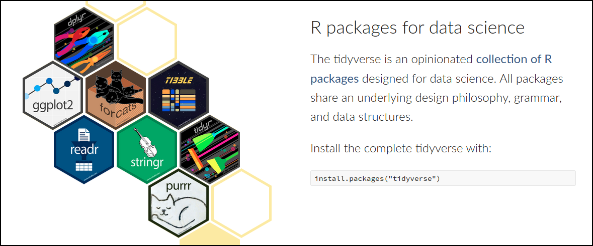
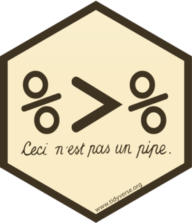
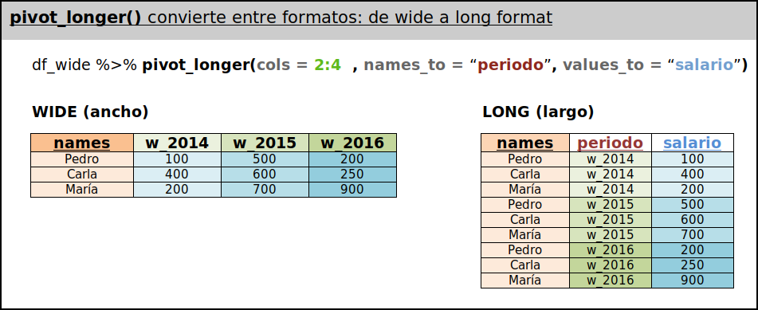
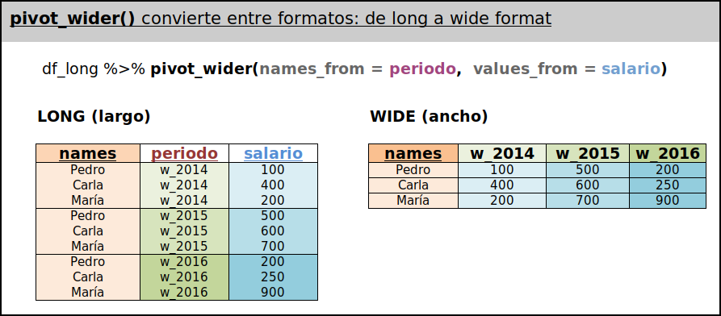
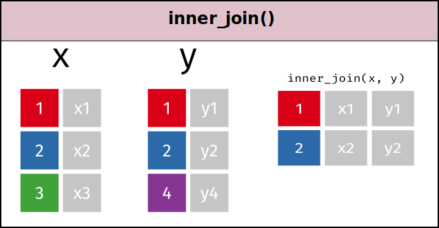
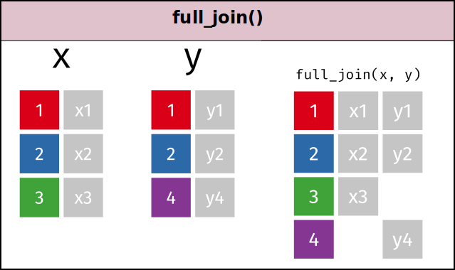
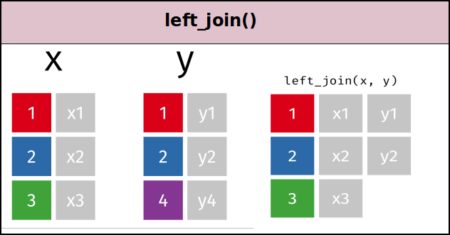

```{r setup, include=FALSE}
options(htmltools.dir.version = FALSE)
#knitr::opts_chunk$set(fig.retina = 3, warning = FALSE, message = FALSE, echo=FALSE, out.width = "85%")
library(metathis)
meta() %>% meta_name("github-repo" = "perezp44/intro-ds-20-21-web") %>% 
  meta_social(
    title = "Data wrangling: manejo de datos con R, the tidyverse way",
    description = paste(
      "Se presentan los principales paquetes del tidyverse para arreglar y manejar datos, os paquetes tidyr y dplyr.",
      "Se presenta el operador pipe, las funciones pivot_longer() y pivot_wider() para hacer los datos tidy, y las principales funciones de dplyr, icluidas las nuevas funciones acroos() y where()."),
    url = "https://perezp44.github.io/intro-ds-20-21-web/slides/ss_05_data-munging/ss_05_data-munging.html#1",   og_type = "website",
    og_author = "Pedro J. Pérez"  )
```


```{r xaringan-extra, include = FALSE}
#options(htmltools.dir.version = FALSE) #- lo pongo en setup
xaringanExtra::use_xaringan_extra(c("tile_view", "logo", "tachyons"))
xaringanExtra::use_clipboard()
xaringanExtra::use_fit_screen()
xaringanExtra::use_tile_view()
xaringanExtra::use_tachyons()
xaringanExtra::use_extra_styles(hover_code_line = TRUE, mute_unhighlighted_code = FALSE)
xaringanExtra::use_panelset()
xaringanExtra::use_share_again()
```

```{r, include = FALSE}
library(tidyverse)
library(gapminder)
```

```{r xaringan-themer, include = FALSE, warning = FALSE}
library(xaringanthemer)
style_mono_light(base_color = "#1c5253", 
                 colors = c(red = "#f34213", purple = "#3e2f5b", orange = "#ff8811", green = "#136f63", white = "#FFFFFF", base = "#1c5253"),
                   link_color = "steelblue")
```


```{r chunk-setup, include = FALSE}
knitr::opts_chunk$set(echo = TRUE, eval = TRUE, message = FALSE, warning = FALSE,
                      #results = "hold",
                      cache = FALSE, cache.path = "/caches/", comment = "#>",
                      #fig.width = 7, #fig.height= 7,
                      #out.width = 7, out.height = 7,
                      collapse = TRUE,  fig.show = "hold", fig.retina = 4,
                      fig.asp = 7/9, out.width = "95%", fig.align = "center")
options(scipen = 999) #- para quitar la notación científica
#- para mejorar los gráficos, bueno en realidad para que se vean igual en distintos SO
#- https://www.jumpingrivers.com/blog/r-knitr-markdown-png-pdf-graphics/
knitr::opts_chunk$set(dev = "png", dev.args = list(type = "cairo-png"))
```


class: inverse, center, middle
# Data wrangling: manejo de datos con R, the tidyverse way
##### (Slides 05(bis) del curso Programación y manejo de datos con R)

### Pedro J. Pérez  

#### Universitat de València 
#### 2020, septiembre 
###### (actualizadas el `r format(Sys.time(), '%d-%m-%Y')`)

<br><br><br>
#### e-mail: [`r icon::fa("envelope")`](mailto:pedro.j.perez@uv.es)[pedro.j.perez@uv.es](mailto:pedro.j.perez@uv.es)

#### Web del curso: [`r icon::fa("link")`](https://perezp44.github.io/intro-ds-20-21-web/) https://perezp44.github.io/intro-ds-20-21-web/  
```{r echo = FALSE}
xaringanExtra::style_share_again(share_buttons = c("twitter", "linkedin", "pocket") )
```


---
class: inverse, center, middle

# Data munging: the tidyverse way

<html><div style='float:left'></div><hr color='#EB811B' size=1px width=796px></html>

---
class: inverse

#### Aprendimos a cargar datos, pero es raro que los datos esten preparados para empezar nuestro análisis, así que hay que "arreglar/limpiar" los datos. 

<br>


<html><div style='float:left'></div><hr color='#EB811B' size=1px width=796px></html>

--

##### Antes de empezar el verdadero análisis, tenemos que: 

##### 1) hacer nuestros datos TIDY,

##### 2) arreglarlos para que sean útiles para nuestros propósitos.


<br>

```{r,  echo = FALSE, eval = TRUE, fig.asp = 4/2, out.width = "70%", fig.align = "center"}
knitr::include_graphics("./imagenes/ss_05_img_01_data-wrangle.png")
```

---

### Limpieza de los datos

- El procesado/limpieza de los datos suele ocupar un 80% del tiempo de un análisis de datos.


> Classroom data are like teddy bears; real data are like a grizzly with salmon blood dripping out its mouth. —- [@JennyBryan]


```{r, echo = FALSE, eval = TRUE, fig.asp = 4/2, out.width = "85%", fig.align = "center"}

```


- Aprenderemos a limpiar y transformar datos en R. Priorizaremos la nueva forma de hacer las cosas en R (o workflow) conocido como [**tidyverse**](https://www.tidyverse.org/). 


---
background-image: url(imagenes/ss_05_img_03_tidyverse-hex.png)
background-position: 95% 5%
background-size: 7%

#### Tidyverse

Conjunto de paquetes que trabajan en armonía y que permiten una nueva forma de escribir/programar en R.


```{r, eval = TRUE, echo = FALSE}
knitr::include_url("https://www.tidyverse.org/")
```

---
background-image: url(imagenes/ss_05_img_03_tidyverse-hex.png)
background-position: 95% 5%
background-size: 7%

#### Principales pkgs del Tidyverse


.pull-left[
- **`tidyr`**: convertir a tidy data  

- **`dplyr`**: para manipular datos    

- **`ggplot2`**: para hacer gráficos  


- .grey[**`readr`**: para importar datos]
- .grey[**`tibble`**: data frames actualizados]   
- .grey[**`forcast`**: para manipular factores]
- .grey[**`stringr`**: para manipular strings]
- .grey[**`purrr`**: functional programming]  


- .grey[ ... y algunos más]

]

.pull-right[
```{r,  echo = FALSE, eval = TRUE,  out.width = "120%", fig.align = "center"}

```
]


&nbsp;  

.bg-washed-green.b--dark-green.ba.bw2.br3.shadow-5.ph4.mt5[
Nos centraremos en los **tres primeros paquetes**, principalmente en **`dplyr`** y **`ggplot2`**.
]


---
background-image: url(imagenes/ss_05_img_03_tidyverse-hex.png)
background-position: 95% 5%
background-size: 7%

#### Tidyverse


> Programs must be written for people to read, and only incidentally for machines to execute  -- Hal Abelson

&nbsp;  

Dos principios del *tidyverse*:

  - Los scripts deben ser **"fácilmente" legibles por las personas**  
  
  - **Resolver problemas complejos** encadenando funciones simples con el **operador pipe (`%>%`)**


<br>

#### The pipe

El operador **pipe** se lo debemos a Stefan Bache en su pkg [magrittr](https://github.com/tidyverse/magrittr)


```{r,  echo = FALSE, eval = TRUE, fig.asp = 4/2, out.width = "15%", fig.align = "center"}

```

---
class: inverse, center, middle
background-image: url(imagenes/ss_05_img_04_pipe-hex.png)
background-position: 95% 5%
background-size: 15%

# The pipe

<html><div style='float:left'></div><hr color='#EB811B' size=1px width=796px></html>

El operador %>% es crucial en el tidyverse. hay que entenderlo. Es fácil. Pronto os sentiréis cómodos con él.

---
background-image: url(imagenes/ss_05_img_04_pipe-hex.png)
background-position: 95% 5%
background-size: 7%

#### The pipe

The pipe es un operador que pasa el elemento que está a su izquierda como un argumento de la función que tiene a la derecha. .red[That's all!!!]

.bg-washed-green.b--dark-green.ba.bw2.br3.shadow-5.ph4.mt5[
**Con expresiones** el operador pipe hace: 

.red[f](.orange[object], .purple[args. of the f.])  .grey[...  es equivalente a  ...] .orange[object] %>% .red[f](.purple[args. of the f.])
]

&nbsp;  


##### Igual os resulta más fácil con ejemplos. Las siguientes 2 expresiones hacen exactamente lo mismo:

```{r, eval = FALSE}
library(palmerpenguins)

head(penguins, n = 4) #- forma habitual de llamar/usar la función head()

penguins %>% head(. , n = 4) #- usando el operador pipe
```


---
background-image: url(imagenes/ss_05_img_04_pipe-hex.png)
background-position: 95% 5%
background-size: 7%

#### The pipe (más ejemplos)

Estas 3 expresiones también son equivalentes, hacen exactamente lo mismo:

```{r, eval = FALSE}
head(penguins, n = 4)         #- forma habitual de llamar/usar la función head()

penguins %>% head(. , n = 4)  #- usando el operador pipe (con el punto actuando como placeholder)

penguins %>% head(n = 4)      #- usando el operador pipe (SIN el punto)
```

--

-------------------

¿Qué hace la siguiente expresión?

```{r, eval = FALSE}
4 %>% head(penguins, .)
```

--

---------------------

Y, ¿por qué no funciona la siguiente expresión?

```{r, eval = FALSE}
4 %>% head(penguins)
```


--

---------------------
Intenta descubrir/entender que hace la siguiente expresión:

```{r, eval = FALSE}
letters %>% paste0( "-----" ,  .  ,  "!!!" ) %>% toupper
```


---
class: inverse, center, middle
background-image: url(imagenes/ss_05_img_06_tidyr-hex.png)
background-position: 95% 5%
background-size: 15%


# Tidy data

<html><div style='float:left'></div><hr color='#EB811B' size=1px width=796px></html>

Para trabajar à la tidyverse es crucial que los datos sean "tidy". El concepto de datos tidy es sencillo. Hacer los datos tidy no tanto pero tenemos un paquete para hacerlo fácil: el pkg *tidyr* 

---
background-image: url(imagenes/ss_05_img_06_tidyr-hex.png)
background-position: 95% 5%
background-size: 7%

#### Tidy data

Un aspecto importante del tidyverse es hacer los datos **tidy**. 

Unos datos son tidy si: (1) cada columna es una variable, (2) cada fila es una observación y (3) cada valor debe esta/tiene su propia celda.

<br>

> A dataset is a **collection of values**. Every value belongs to a variable and an observation. 

> A variable contains all values that measure the same underlying attribute (like height, temperature, duration) across units.   

> An observation contains all values measured on the same unit (like a person, or a day, or a race) across atributes.


```{r , echo=FALSE, eval = TRUE, fig.asp = 4/2, out.width = "75%", fig.align = "center"}
knitr::include_graphics("./imagenes/ss_05_img_11_tidy-data.png")
```


---
background-image: url(imagenes/ss_05_img_06_tidyr-hex.png)
background-position: 95% 5%
background-size: 7%

#### Tidy data  

Veámoslo un poco con ejemplos:

.panelset[
.panel[.panel-name[Ejemplo 1]
.pull-left[
```{r}
data_1 <- data.frame(
            year  = c("2014", "2015", "2016"),  
            Pedro = c(100, 500, 200), 
            Carla = c(400, 600, 250), 
            María = c(200, 700, 900)  )
```
]
.pull-right[
```{r, echo = TRUE}
DT::datatable(data_1)
```
]
]

.panel[.panel-name[Ejemplo 2]
.pull-left[
```{r}
data_2 <- data.frame(names = c("Pedro", "Carla", "María"), 
                      W_2014 = c(100, 400, 200), 
                      W_2015 = c(500, 600, 700),
                      W_2016 = c(200, 250, 900)   )
```
]
.pull-right[
```{r, echo = TRUE}
knitr::kable(data_2)
```
]
]

.panel[.panel-name[Ejemplo 3]
.pull-left[
```{r}
data_3 <- data.frame(
            names =rep(c("Pedro", "Carla", "María"), times = 3),  
            year = rep(c("2014", "2015", "2016"), each = 3),
            salario = c(100, 400, 200, 500, 600, 700, 200, 250,900) )
```
]
.pull-right[
```{r, echo = TRUE}
gt::gt(data_3)
```
]
]
]


---
class: inverse, center, middle
background-image: url(imagenes/ss_05_img_06_tidyr-hex.png)
background-position: 95% 5%
background-size: 13%


# Tidy data en formato *LONG*

<html><div style='float:left'></div><hr color='#EB811B' size=1px width=796px></html>

Para trabajar à la tidyverse es crucial que los datos sean "tidy" y además que estén en formato *LONG*. 

Es importante aprender a pasar de datos WIDE a LONG y viceversa. 

Con el pkg tidyr es sencillo pero ...

---
background-image: url(imagenes/ss_05_img_06_tidyr-hex.png)
background-position: 95% 5%
background-size: 6%
#### De wide a LONG format con `pivot_longer()`


```{r,  echo = FALSE, eval = TRUE, fig.asp = 4/2, out.width = "90%", fig.align = "center"}

```
   
.panelset[
.panel[.panel-name[Tarea]
 Aquí tienes un df en formato ANCHO, pásalo a formato LARGO

```{r}
data_2 <- data.frame(names = c("Pedro", "Carla", "María"), 
                      W_2014 = c(100, 400, 200), 
                      W_2015 = c(500, 600, 700),
                      W_2016 = c(200, 250, 900) )
data_wide <- data_2   

```
]

.panel[.panel-name[Solución]

```{r, eval = FALSE}

#- la función pivot_longer() transforma los datos de formato ancho(wide) a formato largo(long)

data_long <- data_wide %>% 
             tidyr::pivot_longer(cols = 2:4, names_to = "periodo")

```
]
]


---
background-image: url(imagenes/ss_05_img_06_tidyr-hex.png)
background-position: 95% 5%
background-size: 6%
#### De long a WIDE format con `pivot_wider()`


```{r,  echo = FALSE, eval = TRUE, fig.asp = 4/2, out.width = "90%", fig.align = "center"}

```
   
.panelset[
.panel[.panel-name[Tarea]
En el ejercicio anterior hemos creado un df en formato LONG, lo hemos llamado `df_long`. 

La tarea consiste en convertir `df_long` a formato ANCHO.

]

.panel[.panel-name[Solución]

```{r, eval = FALSE}

data_wide2 <- data_long %>% 
              tidyr::pivot_wider(names_from = periodo, 
                                 values_from = value)
```
]
]

---
class: inverse, center, middle

## Más funciones de *tidyr*

<html><div style='float:left'></div><hr color='#EB811B' size=1px width=796px></html>

#### El paquete *tidyr* tiene muchas funciones. Veremos dos: *separate()* y *unite()*


---
background-image: url(imagenes/ss_05_img_06_tidyr-hex.png)
background-position: 95% 5%
background-size: 6%
#### `separate()` y `unite()`

- `separate()` y `unite()` facilitan el separar y unir columnas. Por ejemplo fíjate en el siguiente dataframe:

```{r, echo = FALSE, eval = TRUE}
df <- data.frame( names = c("Pedro_Navaja", "Bob_Dylan", "Cid_Campeador"), 
                  year  = c(1978, 1941, 1048) )
gt::gt(df)
```

--


.panelset[
.panel[.panel-name[Separar la 1ª columna]
.pull-left[
```{r}
df_a <- df %>% 
      separate(col = names, 
              into = c("Nombre", "Apellido"),
              sep  = "_")

```
]
.pull-right[
```{r, echo = TRUE, eval = TRUE}
gt::gt(df_a)
```
]
]

.panel[.panel-name[Volvamos a unir las columnas]
.pull-left[
```{r}
df_b <- df_a %>% 
       unite(Nombre_y_Apellido, 
             Nombre:Apellido, 
             sep = "&")
```
]
.pull-right[
```{r, echo = TRUE}
gt::gt(df_b)
```
]
]
]

---
class: inverse, center, middle
background-image: url(imagenes/ss_05_img_07_dplyr-hex-new.png)
background-position: 95% 5%
background-size: 15%

## DPLYR

<html><div style='float:left'></div><hr color='#EB811B' size=1px width=796px></html>

#### *dplyr* es el paquete más importante a la hora de manipular datos.

---
background-image: url(imagenes/ss_05_img_07_dplyr-hex-new.png)
background-position: 99% 1%
background-size: 6%

#### DPLYR

- `dplyr` es un paquete que permite manipular datos de forma intuitiva. Tiene 6-7 funciones o verbos principales. 

- Cada uno de ellos hace “una sola cosa”, así que para realizar transformaciones complejas hay que ir concatenando instrucciones sencillas con el operador pipe (`%>%`)

<br>

--

#### Sintaxis 

Todas las funciones tienen una estructura o comportamiento similar:

  - el primer argumento siempre es un df (esto es importante).      
  - los siguientes argumentos describen que hacer con los datos.     
  - el resultado es siempre un nuevo df (esto es importante).  


Las siguientes 3 expresiones hacen exactamente lo mismo:

```{r, echo = TRUE, eval = FALSE}
filter(df, X1 >= 10)

df %>% filter(. , X1 >= 10)

df %>% filter(X1 >= 10)
```


---
background-image: url(imagenes/ss_05_img_07_dplyr-hex-new.png)
background-position: 99% 1%
background-size: 6%

#### Principales funciones de dplyr

  - **`filter()`** : selecciona **filas** (que cumplen una o varias condiciones)
  - **`arrange()`**: reordena las filas
  - **`rename()`** : cambia los nombres de las columnas 
  - **`select()`** : selecciona **columnas** 
  - **`mutate()`** : crea nuevas variables
  - **`summarise()`** : resume (colapsa) unos cuantos valores a uno sólo. Por ejemplo, calcula la media, moda, etc... de un conjunto de valores
 
--
 
Hay una séptima función:

  - **`group_by()`** : permite agrupar filas en función de una o varias condiciones

--

<br>

Y después de `dplyr 1.0.0`, en mayo de 2020, dos funciones más:

  - **`across()`**   y **`where()`**. Estas funciones son un poco diferentes, solo se usan en combinación de otra función/verbo. Son 2 funciones que en la jerga del tidyverse no son verbos sino adverbios. Lo vemos


--

##### Vamos a trabajar con los datos del [pkg gapminder](https://github.com/jennybc/gapminder)


```{r}
gapminder <- gapminder::gapminder  #- cargamos los datos
```

---
background-image: url(imagenes/ss_05_img_07_dplyr-hex-new.png)
background-position: 99% 1%
background-size: 6%


#### 1.A **`filter()`**: permite seleccionar **filas**

Filas que cumplan una determinadas condiciones o criterios lógicos. Por ejemplo:

```{r, echo = TRUE, eval = FALSE}
gapminder <- gapminder::gapminder  #- cargamos los datos


#- Observaciones de España (country == "Spain")
aa <- gapminder %>% filter(country == "Spain") 

#- filas con valores de "lifeExp" < 29
aa <- gapminder %>% filter(lifeExp < 29)       

#- filas con valores de "lifeExp" entre [29, 32]
aa <- gapminder %>% filter(lifeExp >=  29 , lifeExp <= 32)   
aa <- gapminder %>% filter(lifeExp >=  29 &  lifeExp <= 32)  
aa <- gapminder %>% filter(between(lifeExp, 29, 32))       

#- observaciones de países de África con lifeExp > 32
aa <- gapminder %>% filter(lifeExp > 72 &  continent == "Africa") 

#- observaciones de países de África o Asia con lifeExp > 32
aa <- gapminder %>% filter(lifeExp > 72 &  continent %in% c("Africa", "Asia") )  
aa <- gapminder %>% filter(lifeExp > 72 & (continent == "Africa" | continent == "Asia") )  
```


---
background-image: url(imagenes/ss_05_img_07_dplyr-hex-new.png)
background-position: 99% 1%
background-size: 6%

#### 1.B **`slice()`**: permite seleccionar **filas** pero **por posición**.

`filter()` y `slice()` ambas seleccionan filas, la primera por condiciones y la segunda por posición:

```{r}
#- selecciona las observaciones de la décima a la quinceava
aa <- gapminder %>% slice(c(10:15)) 

#- selecciona las observaciones de la 12 a 13 Y de la 44 a 46, Y las 4 últimas
aa <- gapminder %>% 
     slice( c(12:14, 44:46, n()-4:n()) ) #- AQUI hay un error, tenéis que arreglarlo. 

#- Pista: igual os ayuda crear una columna con el índice de rows y repetir el cálculo
aa <- gapminder %>% mutate(index = 1:n())
aa <- gapminder %>% slice( c(12:14, 44:46, n()-4:n()) )
```

---
background-image: url(imagenes/ss_05_img_07_dplyr-hex-new.png)
background-position: 99% 1%
background-size: 6%

#### 1.C Variantes de **`slice()`**

- `slice_max()` y `slice_min()`: seleccionan filas con valor máximo (o mínimo) de una variable: 

```{r, echo = TRUE, eval = FALSE}
#- selecciona las 3 filas con mayor valor de lifeExp
aa <- gapminder %>% slice_max(lifeExp, n = 3)

#- selecciona las 4 filas con MENOR valor de pop
aa <- gapminder %>% slice_min(pop, n = 4)

#- observaciones en el primer decil en cuanto a esperanza de vida, 10% con menor esperanza de vida
aa <- gapminder %>% slice_min(lifeExp, prop = 0.1)

#- 1% de observaciones con mayor población. Imagino que estarán China e India
aa <- gapminder %>% slice_max(pop, prop = 0.01)
````

--

---------------------

A veces se necesita obtener una muestra aleatoria de los datos: por ejemplo con `slice_sample()`:


```{r, eval = FALSE}
#- selecciona (aleatoriamente) 100 filas de los datos
aa <- gapminder %>% slice_sample(n = 100)

#- selecciona (aleatoriamente) un 5% de los datos
aa <- gapminder %>% slice_sample(prop = 0.05)
```

---
background-image: url(imagenes/ss_05_img_07_dplyr-hex-new.png)
background-position: 99% 1%
background-size: 6%

#### 2. **`arrange()`**: permite **reordenar las filas** de un df


```{r, echo = TRUE, eval = FALSE}
#- ordena las filas de MENOR a mayor según los valores de la v. lifeExp 
aa <- gapminder %>% arrange(lifeExp)

#- ordena las filas de MAYOR a menor según los valores de la v. lifeExp
aa <- gapminder %>% arrange(desc(lifeExp))  

#- ordena las filas de MENOR a mayor según los valores de la v. lifeExp. 
#- Si hay empates se resuelve con la variable "pop"
aa <- gapminder %>% arrange(lifeExp, pop) 
```


---
background-image: url(imagenes/ss_05_img_07_dplyr-hex-new.png)
background-position: 99% 1%
background-size: 6%

#### 3. **`rename()`**: permite cambiar los nombres de las variables


```{r, echo = TRUE, eval = FALSE}
#- cambia los nombres de lifeExp y gdpPercap a life_exp y gdp_percap 
gapminder %>% rename(life_exp = lifeExp,  gdp_percap = gdpPercap)
```

##### la función names() es útil

```{r, echo = TRUE, eval = FALSE}
#-(!!) la función names() de R-base es muy útil. 
aa <- gapminder

names(aa) <- names(aa) %>% toupper
names(aa) <- names(aa) %>% tolower
```

#### `rename_with()` permite hacer transformaciones más complejas, 

```{r, eval = FALSE}
aa <- gapminder

aa %>% rename_with(toupper)

rename_with(aa, toupper, starts_with("Life") | contains("countr"))

rename_with(aa, ~ str_replace(.x, "e", "Ö"))  #- (!!!!)
```


---
background-image: url(imagenes/ss_05_img_07_dplyr-hex-new.png)
background-position: 99% 1%
background-size: 6%

#### 4.A **`select()`** se utiliza para seleccionar variables


##### seleccionar variables por nombre


```{r, echo = TRUE, eval = FALSE}
aa <- gapminder %>% select(year, lifeExp) 
```

##### seleccionar variables por posición

```{r, echo = TRUE, eval = FALSE}
aa <- gapminder %>% select(1:3, 5)
```


--

-----------------

##### eliminar variables


```{r}
aa <- gapminder %>% select(-year)

#- Para eliminar varias variables
aa <- gapminder %>% select(-c(year, lifeExp))
```

##### eliminar variables por posición


```{r, echo = TRUE, eval = FALSE}
aa <- gapminder %>% select(-c(1:3, 5))
```


---
background-image: url(imagenes/ss_05_img_07_dplyr-hex-new.png)
background-position: 99% 1%
background-size: 6%

#### 4.B **`select()`** junto a la función  **`where()`**

- `select()` y `where()` son dos funciones, sí, pero en la jerga del tidyverse, `select()` es un verbo y `where()` es un adverbio, cualifica/cambia lo que hace `select()`.

--

------------------

##### ejemplo de uso

- En `gapminder` las 2 primeras variables (country y continent) son factores y las 4 siguientes son variable numéricas. 

- Imagina que queremos seleccionar sólo las variables que son numéricas. Podemos hacerlo por nombre o por posición pero mejor con `select()` y la función auxiliar `where()`


```{r, echo = TRUE, eval = FALSE}
aa <- gapminder %>% select(is.numeric)        #- funciona, pero ...

aa <- gapminder %>% select(where(is.numeric)) #- es "preferible" esta segunda expresión
```

--

---------------

- Si queremos seleccionar las variables que **no** son numéricas haríamos:


```{r, echo = TRUE, eval = FALSE}
aa <- gapminder %>% select(!where(is.numeric)) 
```


---
background-image: url(imagenes/ss_05_img_07_dplyr-hex-new.png)
background-position: 99% 1%
background-size: 6%

#### 4.C.1 **`select()`** para renombrar y reordenar las variables


```{r, echo = TRUE, eval = FALSE}
#- dejamos en aa solamente a las columnas "year" y "pop"; ADEMÁS, ahora, "pop" irá antes que "year"
aa <- gapminder %>% select(pop, year)

#- dejamos en aa solamente a las columnas "year" y "pop" y les cambiamos el nombre
aa <- gapminder %>% select(poblacion = pop, año = year)
```

<br>

Imagina que quieres que la última columna pase a ser la primera (manías!!). Podemos hacerlo con select y `everything()`. everything es una **función auxiliar**:

```{r, echo = TRUE, eval = FALSE}
#- "gdpPercap" que es la última columna pasa a ser la primera
aa <- gapminder %>% select(gdpPercap, everything())
```

--

<br>

------------


#### 4.C.2  `relocate() ` otra función para reordenar las variables de un df

```{r, echo = TRUE, eval = FALSE}
aa <- gapminder %>% dplyr::relocate(country, .after = lifeExp)

aa <- gapminder %>% dplyr::relocate(country, .before = lifeExp)
```


---
background-image: url(imagenes/ss_05_img_07_dplyr-hex-new.png)
background-position: 99% 1%
background-size: 6%

#### 5 **`mutate()`** para crear nuevas variables

- Por ejemplo, creamos la variable: GDP = pop*gdpperCap


```{r, echo = TRUE, eval = FALSE}
aa <- gapminder %>% mutate(GDP = pop*gdpPercap)
```

Por defecto, la nueva variable creada se situará al final del df, a no ser que usemos los argumentos `.after` y `.before`


```{r, echo = TRUE, eval = FALSE}
aa <- gapminder %>% mutate(GDP = pop*gdpPercap, .after = country)

aa <- gapminder %>% mutate(GDP = pop*gdpPercap, .before = country)
```


---
background-image: url(imagenes/ss_05_img_07_dplyr-hex-new.png)
background-position: 99% 1%
background-size: 6%

#### 6.A **`summarize()`** para "resumir" variables

- Coge una variable como input y devuelve un solo valor; por ejemplo, haya la media aritmética (o el mínimo, o el máximo ...) de una columna/variable.

- Empezamos "resumiendo" una sola variable:

```{r, echo = TRUE, eval = FALSE}
aa <- gapminder %>% summarise(media = mean(lifeExp))  
aa <- gapminder %>% summarise(desviacion_tipica = sd(lifeExp))  
aa <- gapminder %>% summarise(max(pop))  
aa <- gapminder %>% summarise(NN = n())  

aa <- gapminder %>% count()      #- más adelante veremos la utilidad de count()
```

--

---------------------

- "Resumimos" dos variables:

```{r, echo = TRUE, eval = FALSE}
#- retornará 2 valores: las medias de "lifeExp" y "gdpPercap"
aa <- gapminder %>% summarise(mean(lifeExp), mean(gdpPercap))  
```


--

---------------------

- Hacemos 2 resúmenes de una variable:

```{r, echo = TRUE, eval = FALSE}
#- retornará 2 valores: la media y sd de la v. "lifeExp"
aa <- gapminder %>% summarise(mean(lifeExp), sd(lifeExp))
```


---
background-image: url(imagenes/ss_05_img_07_dplyr-hex-new.png)
background-position: 99% 1%
background-size: 6%

#### 6.B **`summarize()`** con `across()`

Usar `across()` permitirá calcular estadísticos de todas las variables, o de subconjuntos de estas, de manera más cómoda:


```{r, echo = TRUE, eval = FALSE}
#- media de cada una de las 6 variables. Devuelve 2 warnings porque las 2 primeras son textuales. No se puede calcular la media de continent y country
gapminder %>% summarise(across(everything(), mean) ) 

#- calculamos la media de tercera a la sexta variable
gapminder %>% summarise(across(3:6, mean) ) 
```

<br>

O sea, `across()` permite seleccionar variables para hacer summaries. Dentro de `across()` se puede utilizar `where()` para aplicar criterios lógicos para seleccionar variables: 

```{r, echo = TRUE, eval = FALSE}
gapminder %>% summarise(across(where(is.numeric), mean)) 

#- con los nombres de los argumentos (más largo pero conviene verlo de vez en cuando)
gapminder %>% summarise(across(.cols = where(is.numeric), .fns = mean)) 
```


---
background-image: url(imagenes/ss_05_img_07_dplyr-hex-new.png)
background-position: 99% 1%
background-size: 6%

#### 6.B **`summarize()`** con `across()`  y varias funciones(list)

- Si quieres calcular dos summaries de varias variables; por ejemplo la media y la desviación típica de un grupo de variables, tendrás que seguir utilizando `summarise()` con `across()` pero, además, tendrás que poner la lista de funciones dentro de `list`. Veámoslo:


```{r, echo = TRUE, eval = FALSE}
#- calculamos la media y desviación típica de las columnas 3 a 6.
gapminder %>% summarise(across(3:6, list(media = mean, desv = sd)))

#- lo mismo, pero explicitando los nombres de los argumentos
gapminder %>% summarise(across(.cols = 3:6, .fns = list(media = mean, desv = sd) ))

#- lo mismo otra vez, pero eligiendo el nombre de las variables que se van aa crear con .names
gapminder %>% summarise(across(3:6, list(media = mean, desv = sd), .names = "{fn}_{col}"))
```


---
background-image: url(imagenes/ss_05_img_07_dplyr-hex-new.png)
background-position: 99% 1%
background-size: 6%

#### 7. **`group_by()`**. Con está función ya se puede ver la potencia de `dplyr`

En análisis de datos muchas operaciones  queremos calcularlas para distintos grupos (p. ej. mujer/hombre,  ...). `group_by()` permite hacerlo.

`group_by()` coge un df y lo convierte en un **"df agrupado"**. En ese nuevo "df agrupado", las operaciones que hagamos, se harán por separado para cada uno de los grupos que hayamos definido. Ahora lo vemos.

--

```{r, echo = TRUE, eval = TRUE}
#- cogemos df y lo (des)agrupamos por grupos 
#- definidos por la variable "continent"; o sea, habrá 5 grupos
#- después con summarise() calcularemos el nº de observaciones en cada grupo;
#- es decir, nos retornará un df con una fila por cada continente

aa <- gapminder %>% group_by(continent) %>% summarise(NN = n()) 
aa
```


---
background-image: url(imagenes/ss_05_img_07_dplyr-hex-new.png)
background-position: 99% 1%
background-size: 6%

#### 7. **`group_by()`**. 

#### ¿Cuantos países hay en la base de datos? 

- Una forma "chapucera" de hacerlo

```{r, echo = TRUE, eval = FALSE}
aa <- gapminder %>% group_by(country) %>%  
          summarize(NN = n())
```

--

--------------------

- Mejor así:


```{r, echo = TRUE, eval = TRUE}
#- cogemos df y lo agrupamos por "continent", 
#- después calculamos 2 cosas: el número de observaciones o rows
#- y el número de países en cada continente (NN_countries)
aa <- gapminder %>% group_by(continent) %>%  
          summarize(NN = n(), 
                    NN_countries = n_distinct(country)) 
aa
```


---
background-image: url(imagenes/ss_05_img_07_dplyr-hex-new.png)
background-position: 99% 1%
background-size: 6%

#### 7. **`group_by()`**. 

- También se puede así:


```{r, echo = TRUE, eval = TRUE}
aa <- gapminder %>% group_by(continent) %>%  
          summarize(NN = n(), 
                    NN_countries = length(unique(country)) )
aa
```

---
class: inverse, center, middle

# Ejemplos para afianzar y ganar confianza con  *dplyr*

<html><div style='float:left'></div><hr color='#EB811B' size=1px width=796px></html>

Una vez tenemos, aunque sea con pinzas, los conocimientos necesarios de *dplyr*, ya podemos hacer ejemplos o preguntas de verdad. El objetivo es afianzarlos y ganar confianza con *dplyr*. Vamos allaaaa ....

---

### Ejemplos para practicar `dplyr`

.bg-washed-purple.b--dark-purple.ba.bw2.br3.shadow-5.ph4.mt5[
.panelset[
.panel[.panel-name[Tarea 1]
Primero algo sencillo para calentar: hay que calcular **la esperanza de vida media por continente**.

]
.panel[.panel-name[Solución 1]

```{r, echo = TRUE, eval = TRUE}
#- cogemos df y lo agrupamos por "continent", 
#- después calculamos la media de "lifeExp"

gapminder %>% group_by(continent) %>%  
              summarize(mean(lifeExp)) 
```

]
.panel[.panel-name[Tarea 2]
Calculemos la esperanza de vida media por continente en el primer periodo (1952)
]
.panel[.panel-name[Solución 2]

```{r, echo = TRUE, eval = FALSE}
#- cogemos df y filtramos para quedarnos con las observaciones de 1952
#- después lo agrupamos por "continent", 
#- después calculamos la media de "lifeExp"

gapminder %>% filter(year == "1952") %>%  
              group_by(continent) %>%  
              summarize(mean(lifeExp)) 
```
]
.panel[.panel-name[Tarea 3]

¿Qué hace este trozo de código?

```{r, eval = FALSE}

gapminder %>% filter(year %in% c(1952, 2007)) %>%  
             group_by(continent, year) %>%  
             summarize(mean(lifeExp), mean(gdpPercap)) 
```

]
.panel[.panel-name[Solución 3]
```{r}
#- cogemos df y filtramos las observaciones de 1952 y 2007
#- agrupamos por "continent", 
#- después calculamos la media de "lifeExp" y de "gdpPercap"

gapminder %>% filter(year %in% c(1952, 2007)) %>%  
             group_by(continent, year) %>%  
             summarize(mean(lifeExp), mean(gdpPercap)) 

```
]
]
]

---
#### Más ejemplos (para recordar `across()`)


```{r, eval = FALSE}
#- Voy a crear un nuevo df: "gapminder_gr" o "gapminder agrupado"
gapminder_gr <- gapminder %>% filter(year %in% c(1952, 2007)) %>%
                 group_by(continent, year) 
#- y sobre "gapminder_gr" iremos haciendo cálculos
  
#- si queremos calcular la media de varias variables tenemos que usar across()
gapminder_gr %>% summarise(across(c(lifeExp, gdpPercap), mean))

#- si queremos calcular la media de todas las variables numéricas tenemos que usar across() y where()
gapminder_gr %>% summarise(across(where(is.numeric), mean))

#- si queremos calcular la media y la mediana, hay que usar list()
gapminder_gr %>% summarise(across(c(lifeExp, gdpPercap), 
                            list (media = mean, mediana = median) ))

#- si ponemos los nombres de los argumentos quedaría como
gapminder_gr %>% summarise(across(.cols = c(lifeExp, gdpPercap), 
                                  .fns = list (media = mean, mediana = median)))

#- además, podemos controlar el nombre de las variables creadas con el argumento .names
gapminder_gr %>% summarise(across(c(lifeExp, gdpPercap), 
                        list (media = mean, mediana = median), 
                        .names = "{fn}_{col}"))
```


---
class: inverse, center, middle

# Ahora ya preguntas de VERDAD

<html><div style='float:left'></div><hr color='#EB811B' size=1px width=796px></html>

Yo creo que ya medio pilotáis, así que vamos a tratar de resolver alguna pregunta "de verdad"

---

##### pregunta de verdad: ¿en que continente ha aumentado más la esperanza de vida en el periodo 1952-2007?


.bg-washed-purple.b--dark-purple.ba.bw2.br3.shadow-5.ph4.mt5[
.panelset[
.panel[.panel-name[Intento 0]

```{r}
gapminder %>% 
  filter(year %in% c(1952, 2007)) %>%  
  group_by(continent, year) %>% 
  summarize(media = mean(lifeExp)) %>% ungroup()
```
]

.panel[.panel-name[Intento 1]
```{r}
#- se puede hacer de una vez, pero vamos a partir el código en 2 trozos
aa <- gapminder %>% filter(year %in% c(1952, 2007)) %>%  
  group_by(continent, year) %>% 
  summarize(media = mean(lifeExp)) %>% ungroup()

aa1 <- aa %>% group_by(continent) %>% 
  summarise(min_l = min(media), max_l = max(media)) %>% 
  mutate(dif = max_l-min_l) %>% 
  arrange(desc(dif))

aa1
```

]
.panel[.panel-name[Intento 2]
```{r}
#- segundo intento: se puede hacer de una vez, pero vamos a partir el código en 2 trozos
aa <- gapminder %>% filter(year %in% c(1952, 2007)) %>%  
         group_by(continent, year) %>% 
         summarize(media = mean(lifeExp)) %>% ungroup() 

#- usamos lag()
aa1 <- aa %>% group_by(continent) %>% 
              arrange(year) %>%
              mutate(variac_l = media - lag(media))

#- mostramos los resultados
aa1 %>% filter(year == 2007) %>% arrange(desc(variac_l))
```
]

.panel[.panel-name[Otra forma]
```{r}
#- esta parte es común
aa <- gapminder %>% 
  filter(year %in% c(1952, 2007)) %>%  
  group_by(continent, year) %>% 
  summarize(media = mean(lifeExp)) %>% ungroup()

#- pero ahora usamos pivot_wider()
aa %>% pivot_wider(names_from = year, values_from = media) %>% 
     mutate(dif_l = 2007 - 1952) %>% 
     arrange(desc(dif_l))
```

]
]
]

---

##### Otra pregunta: ¿qué hace el código de abajo?


.bg-washed-purple.b--dark-purple.ba.bw2.br3.shadow-5.ph4.mt5[


```{r, echo = TRUE, eval = FALSE}
aa <- gapminder %>% 
  group_by(continent, year) %>% 
  select(continent, year, lifeExp) %>% 
  summarise(mean_life = mean(lifeExp)) %>% 
  arrange(year) %>% 
  mutate(incre_mean_life_0 = mean_life - first(mean_life)) %>% 
  mutate(incre_mean_life_t = mean_life - lag(mean_life)) %>% 
  arrange(continent)

#- por ejemplo veamos el resultado para Europe
aa %>% filter(continent == "Europe")
```
]


---

#### Por favor, sed conscientes de que: "**Las cosas no salen a la primera**"

En palabras de Jennyfer Bryan:

.bg-washed-purple.b--dark-purple.ba.bw2.br3.shadow-5.ph4.mt5[

> Break the code into pieces, starting at the top, and inspect the intermediate results. That’s certainly how I was able to write such a thing. These commands do not leap fully formed out of anyone’s forehead – they are built up gradually, with lots of errors and refinements along the way. Is the statement above really hard for you to read? If yes, then by all means break it into pieces and make some intermediate objects. Your code should be easy to write and read when you’re done.
]

---
#### Otra pregunta "de verdad"


.bg-washed-purple.b--dark-purple.ba.bw2.br3.shadow-5.ph4.mt5[
.panelset[
.panel[.panel-name[Tarea 1]
- ¿Cómo ha evolucionado la esperanza de vida en España?
]
.panel[.panel-name[Solución 1]

```{r, echo = TRUE, eval = TRUE}
#- variación de lifeExp en Spain año a año (bueno lustro a lustro)
gapminder %>% group_by(country) %>% 
  select(country, year, lifeExp) %>% 
  mutate(lifeExp_gain_cada_lustro = lifeExp - lag(lifeExp)) %>% 
  filter(country == "Spain" )
```

]
.panel[.panel-name[Tarea 2]
 ¿Y la variación acumulada? Fácil!! Sólo tendríamos que sumar o acumular la variable "lifeExp_gain_cada_lustro" que hemos generado anteriormente, así que sólo habría que añadir una linea a nuestro código:
]
.panel[.panel-name[Sol 2.a]
```{r, echo = TRUE, eval = FALSE}
gapminder %>% group_by(country) %>% 
  select(country, year, lifeExp) %>% 
  mutate(lifeExp_gain_cada_lustro = lifeExp - lag(lifeExp)) %>% 
  
#- Al final para hacerlo (como había pensado) me han hecho falta 2 lineas, 
#- porque la primera observación de "lifeExp_gain_cada_lustro" es un NA 
#- y eso hacía que la función cumsum() no funcionase.
  
mutate(lifeExp_gain_cada_lustro2 = 
 `ifelse`(is.na(lifeExp_gain_cada_lustro), 0, lifeExp_gain_cada_lustro)) %>% 
mutate(lifeExp_gain_acumulado = cumsum(lifeExp_gain_cada_lustro2)) %>%   
filter(country == "Spain")
```
]
.panel[.panel-name[Sol 2.b]
Otra solución, además es más fácil:

```{r, echo = TRUE, eval = TRUE}
#- ganancia acumulada (otra forma de hacer lo mismo)
gapminder %>% group_by(country) %>% 
  select(country, year, lifeExp) %>% 
  mutate(lifeExp_gain_acumulada = lifeExp - lifeExp[1])  %>% 
  filter(country == "Spain")
```

]

]
]

---

#### A ver si entendéis estos ejemplos


.bg-washed-purple.b--dark-purple.ba.bw2.br3.shadow-5.ph4.mt5[
.panelset[
.panel[.panel-name[Ejemplo 1]

```{r, echo = TRUE, eval = FALSE}
aa <- gapminder %>%
  filter(continent == "Asia") %>%
  select(year, country, lifeExp) %>%
  group_by(year) %>%
  slice_max(n = 3, lifeExp) %>% 
  arrange(year) 
```

]
.panel[.panel-name[Ejemplo 2]

Una **función auxiliar** que es **muy útil** al utilizarla junto a mutate: `case_when()`. 

```{r, echo = TRUE, eval = FALSE}
aa <- gapminder %>%
  group_by(continent, year)  %>%
  mutate(media_lifeExp = mean(lifeExp)) %>% 
  mutate(media_gdpPercap = mean(gdpPercap)) %>% 
  mutate(GOOD_or_BAD = case_when( 
    lifeExp > mean(lifeExp) & gdpPercap > mean(gdpPercap)  ~ "good",
    lifeExp < mean(lifeExp) & gdpPercap < mean(gdpPercap)  ~ "bad" ,
    lifeExp < mean(lifeExp) | gdpPercap < mean(gdpPercap)  ~ "medium"
    )) %>%
  filter(country == "Spain")
```
]
]
]

---
class: inverse, center, middle

#  Combinando (joining) df's

<html><div style='float:left'></div><hr color='#EB811B' size=1px width=796px></html>

Hasta ahora hemos trabajado con un único df; pero muchas veces tenemos que trabajar con datos que están en varias tablas, así que muchas veces tendremos que juntar o fusionar tablas.

---

#### Dos casos ideales (sencillos de unir): `bind_cols()` y `bind_rows()`


1. Si los 2 dfs tienen **exactamente las mismas filas** o unidades de análisis ( y ademas en el mismo orden). En este caso, solo habría que juntar en una misma tabla las columnas de df1 y de df2. Esto lo podemos hacer con `bind_cols()` (o con **c**bind() de R-base)

```{r, eval = FALSE}
df_1 <- iris[ , 1:2]  ; df_2 <- iris[ , 3:5]

df_1 <- iris %>% select(1:2)  ; df_2 <- iris %>% select(3:5) 

df_3 <- bind_cols(df_1, df_2)

identical(iris, df_3)
```
--

--------------


2. Si los 2 dfs tienen **exactamente las mismas columnas** ( y ademas en el mismo orden). En este caso, se trataría simplemente de juntar todas las observaciones o filas de los 2 df's. Esto lo podemos hacer con `bind_rows()` (o con **r**bind() de R-base)


```{r, eval = FALSE}
df_1 <- iris[1:75, ]  ; df_2 <- iris[76:150, ]

df_1 <- iris %>% slice(1:75)  ; df_2 <- iris %>% slice(76:150) 

df_3 <- bind_rows(df_1, df_2)

identical(iris, df_3)
```

---
### 3 tipos de uniones de tablas


En dplyr hay 3 tipos de funciones(verbos) que se ocupan de diferentes operaciones para unir datasets:

  - **Mutating joins**, añade nuevas variables (o columnas) a un dataframe (df1). Estas nuevas columnas vienen de un segundo df2 (hay varias mutating joins, dependiendo del criterio para seleccionar las filas)

  - **Filtering joins**, filtra las filas (observaciones) de un dataframe (df1) basándose en sí las filas de df1 coinciden (match) o no con una observación del segundo df2

  - **Set operations**, combina las observaciones de los dos datasets (df1 y df2) as if they were set elements.


---
#### Las uniones más comunes son las **mutating joins**.


Hay **3/4 tipos de mutating joins**. Su sintaxis es idéntica, sólo se diferencian en que las filas que se seleccionan dependen del criterio para hacer el match:

  - `inner_join(df1,df2)`: Retorna todas las columnas de df1 y también las de df2, PERO **solo retorna las filas de df1 que tienen una equivalencia en df2**. (la equivalencia se define en función del valor de una variable o variables comunes en df1 y df2)
  
  - `left_join(df1,df2)`: Retorna todas las columnas de df1 y también las de df2; en cuanto a las filas, **retorna TODAS las filas de df1**. (Si hubiesen varios matches entre df1 e df2 se retornan todas las combinaciones!!!!)  
  
  - `full_join(df1,df2)`: Retorna todas las columnas de df1 y también las de df2; en cuanto a las filas, **retorna TODAS las filas de df1 y de df2**. Osea, retorna TODAS las filas y TODAS las columnas de las 2 tablas. (Donde no hay matches retorna NA's)
  
--

  
------------------

Para ver algún ejemplo de joins usaremos estos 2 df's:

```{r}
x <- tibble(id = 1:3, x = paste0("x", 1:3))

y <- tibble(id = (1:4)[-3], y = paste0("y", (1:4)[-3]))
```


 
---
#### Veamos algún ejemplo de Mutating joins


.bg-washed-purple.b--dark-purple.ba.bw2.br3.shadow-5.ph4.mt5[
.panelset[
.panel[.panel-name[Inner join]

```{r, echo = TRUE, eval = FALSE}
#- only includes observations that match in both x and y
df_inner <- inner_join(x, y)
```


```{r , echo=FALSE, eval = TRUE, fig.asp = 4/2, out.width = "75%", fig.align = "center"}

```

]
.panel[.panel-name[Full join]


```{r, echo = TRUE, eval = FALSE}
#- full_join() includes all observations from x and y
df_full_join <- full_join(x, y)
```


```{r , echo=FALSE, eval = TRUE, fig.asp = 4/2, out.width = "75%", fig.align = "center"}

```


]
.panel[.panel-name[Left join]

```{r, echo = TRUE, eval = FALSE}
#- includes all observations in x, regardless of whether they match or not. 
#- This is the most commonly used join because it ensures that you don’t lose observations from your primary table.
df_left_join <- left_join(x, y)
```


```{r, echo = FALSE, eval = TRUE, fig.asp = 4/2, out.width = "75%", fig.align = "center"}

```

]
]
]
