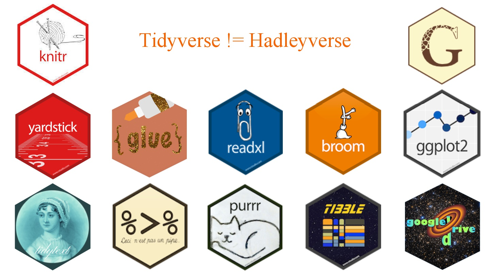

```{r setup, include = FALSE}
options(htmltools.dir.version = FALSE)
xaringanExtra::use_clipboard()
xaringanExtra::use_fit_screen()
```

```{r xaringan-themer, include = FALSE, warning = FALSE}
library(xaringanthemer)
style_mono_light(base_color = "#1c5253", colors = c(red = "#f34213", purple = "#3e2f5b", orange = "#ff8811", green = "#136f63", white = "#FFFFFF"))
```

class: inverse, center, middle

# Dar órdenes a R

<html><div style='float:left'></div><hr color='#EB811B' size=1px width=796px></html>

### Es lo primero que hemos de aprender


---

# Dando órdenes

## en la consola

```{r}
2+2
```

---

### Una imagen


```{r, echo = FALSE,  eval = TRUE,  fig.asp = 2/2, out.width = "60%", fig.align = "center"}
knitr::include_graphics(here::here("imagenes", "ss_02_img_09_pkgs-tidy.jpg"))
```

----

segunda


```{r, echo = FALSE,  eval = TRUE,  fig.asp = 2/2, out.width = "60%", fig.align = "center"}
knitr::include_graphics("../imagenes/ss_02_img_09_pkgs-tidy.jpg")
```


---

la 3

```{r, echo = FALSE, eval = TRUE, out.width = "55%", fig.align = "center", caption = "<https://twitter.com/ReginaNuzzo/status/1156936438451064832>"}
knitr::include_graphics(here::here("ss_03_inicio-curso" , "imagenes", "ss_02_img_09_pkgs-tidy-x.jpg") ) 
```

---

la 4


```{r, echo = FALSE, eval = TRUE, out.width = "55%", fig.align = "center", caption = "<https://twitter.com/ReginaNuzzo/status/1156936438451064832>"}
 
```

