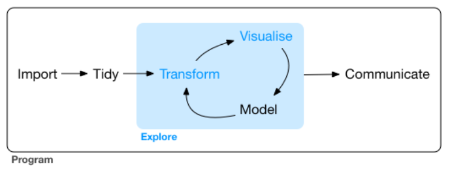

```{r setup, include = FALSE}
options(htmltools.dir.version = FALSE)
xaringanExtra::use_clipboard()   #- https://pkg.garrickadenbuie.com/xaringanExtra/#/clipboard
xaringanExtra::use_fit_screen()  #- Alt/Option+ F —
xaringanExtra::use_tile_view()   #- para  ver todas las slides juntas (press O)
xaringanExtra::use_tachyons()    #- es para las cajitas verdes de texto
xaringanExtra::use_extra_styles(hover_code_line = TRUE, mute_unhighlighted_code = FALSE)
xaringanExtra::use_panelset()    #- https://pkg.garrickadenbuie.com/xaringanExtra/#/panelset
library(tidyverse)
```


```{r chunk-setup, include = FALSE}
knitr::opts_chunk$set(echo = TRUE, eval = TRUE, message = FALSE, warning = FALSE,
                      #results = "hold",
                      cache = FALSE, cache.path = "/caches/", comment = "#>",
                      #fig.width = 7, #fig.height= 7,
                      #out.width = 7, out.height = 7,
                      collapse = TRUE,  fig.show = "hold",
                      fig.asp = 7/9, out.width = "95%", fig.align = "center")
options(scipen = 999) #- para quitar la notación científica
#- para mejorar los gráficos, bueno en realidad para que se vean igual en distintos SO
#- https://www.jumpingrivers.com/blog/r-knitr-markdown-png-pdf-graphics/
knitr::opts_chunk$set(dev = "png", dev.args = list(type = "cairo-png"))
```

```{r xaringan-themer, include = FALSE, warning = FALSE}
library(xaringanthemer)
style_mono_light(base_color = "#1c5253", colors = c(red = "#f34213", purple = "#3e2f5b", orange = "#ff8811", green = "#136f63", white = "#FFFFFF", base = "#1c5253", grey = "#A9A9A9"))
```

```{r, include = FALSE}
library(flipbookr)
```

```{css, include = FALSE}
.remark-code{line-height: 1.5; font-size: 80%}
@media print {
  .has-continuation {
    display: block;
  }
```

class: inverse, center, middle
background-image: url(imagenes/ss_06_img_01_ggplot2-hex.png)
background-position: 95% 5%
background-size: 10%

## Gráficos chulos con *ggplot2*

<html><div style='float:left'></div><hr color='#EB811B' size=1px width=796px></html>

#### Uno de los mejores (que dices!?, el MEJOR!!!) sistema gráfico del MUNDO.

---
background-image: url(imagenes/ss_06_img_01_ggplot2-hex.png)
background-position: 98% 2%
background-size: 5%

- El **análisis gráfico es fundamental** al presentar resultados, pero también en el análisis exploratorio: permite descubrir relaciones entre variables, y descartar o sugerir nuevas preguntas sobre los datos.


```{r, echo = FALSE, out.width = "75%", fig.align = "center"}
 
```

--

--------------------------------------

<br>

- R tiene varios sistemas gráficos, pero **usaremos ggplot2**

- *ggplot2* es un paquete de R para producir gráficos estadísticos. Bueno, en realidad **es todo un ecosistema**. Mira sus extensiones [[aquí]](https://exts.ggplot2.tidyverse.org/gallery/).

- Es diferente porque tiene una **gramática subyacente**, basada en Grammar of Graphics (Wilkinson 2005).

- Cuesta un poco (sólo un poco) más empezar, pero enseguida se ven los beneficios; además, es que **ahora mismo es el estándar**. 

---
class: inverse, center, middle
background-image: url(imagenes/ss_06_img_01_ggplot2-hex.png)
background-position: 95% 5%
background-size: 10%

## Primeras ideas sobre *ggplot2*

<html><div style='float:left'></div><hr color='#EB811B' size=1px width=796px></html>

#### Primeras ideas para empezar a familiarizarnos con *ggplot2*

---
background-image: url(imagenes/ss_06_img_01_ggplot2-hex.png)
background-position: 98% 2%
background-size: 5%

##### ¿qué vemos en el gráfico de abajo?


.pull-left[
```{r, echo = FALSE, out.width = "99%", fig.retina = 4, fig.asp = 6.9/9}
ggplot(iris, aes(Sepal.Length, Petal.Length, color = Species)) + geom_point()
```
]

--

.pull-right[

<br>

- gráfico de puntos  

- se representan 3 variables

- Sepal.Length en el **eje X** 

- Petal.Length en el **eje Y**

- Species en el **color de los puntos**
]

--

Importante para entender ggplot2. Un gráfico tiene 3 componentes principales:
  
  - los **datos** que se van a representar  (.orange[ggplot()] )

  - un conjunto de **propiedades estéticas asociadas variables** del conjunto de datos. Por ejemplo, la posición en el eje X esta asociada a la variable Sepal.Length, el color de los puntos está asociado a los valores de la variable Species.  (  .orange[aes()] )

  - el **elemento geométrico que se va a representar**. En nuestro caso el elemento geométrico que usamos son  puntos, pero podrían haber sido las lineas o ...  (  .grey[geom_xx()], .orange[geom_point()] )

---


```{r, echo = TRUE, out.width = "60%", fig.retina = 4}
ggplot(iris, aes(x = Sepal.Length, 
                 y = Petal.Length, 
                 color = Species)) + 
    geom_point()
```

--
##### Forma más común de escribirlo

```{r, eval = FALSE}
ggplot(iris, aes(Sepal.Length, Petal.Length, color = Species)) + 
    geom_point()
```


---

```{r grafico-00, include = FALSE, fig.retina = 4}
iris %>% 
ggplot() + 
   aes(x = Sepal.Length) +
   aes(y = Petal.Length) +
   aes(color = Species)  + 
  geom_point()
```

`r chunk_reveal(chunk_name = "grafico-00", title = "#### Gráfico en slow-motion!")`

##### La forma habitual de escribirlo es:


```{r, eval = FALSE}
ggplot(iris, aes(Sepal.Length, Petal.Length, color = Species)) + 
    geom_point()
```

---
##### IMAGINA que harán las siguientes instrucciones. Después las ejecutas.


```{r, eval = FALSE}
#- Fíjate: `sólo` hay `2 variables en aes()` -------------------------------------

ggplot(iris, aes(Sepal.Length, Petal.Length)) + 
  geom_point()

#- Fíjate: ahora usamos `geom_line()` ------------------------------------------

ggplot(iris, aes(Sepal.Length, Petal.Length)) + 
  geom_line() 

#- Fíjate: Ahora usamos `2 geom_xx`---------------------------------------------
ggplot(iris, aes(Sepal.Length, Petal.Length)) + geom_point() +  
      geom_smooth() 


#- Fíjate: volvemos a tener 3 variables asociadas a estéticas ----------------

ggplot(iris, aes(Sepal.Length, Petal.Length, color = Species)) + 
  geom_point()

#- Fíjate**: hay `argumentos dentro de geom_point()`---------------------------- 
#- Uno de ellos es `color`

ggplot(iris, aes(Sepal.Length, Petal.Length)) + 
      geom_point(color = "red", size = 2, alpha = 0.2) 
```


---
class: inverse, center, middle
background-image: url(imagenes/ss_06_img_01_ggplot2-hex.png)
background-position: 95% 5%
background-size: 10%

### Entendiendo un poco más *ggplot2*

<html><div style='float:left'></div><hr color='#EB811B' size=1px width=796px></html>

#### Ya tenemos las primeras ideas sobre ggplot2, ahora se trata de profundizar un poco para que podamos tener más control y flexibilidad al hacer nuestros gráficos.


---
####  Vamos a profundizar un poco más en *ggplot2*

Es importante que veas que estas 3 expresiones **hacen el mismo gráfico**:

```{r, echo = TRUE, eval = FALSE}
ggplot(iris, aes(Sepal.Length, Petal.Length)) + geom_point()

ggplot(iris) + geom_point(aes(Sepal.Length, Petal.Length))

ggplot() + geom_point(data = iris, aes(Sepal.Length, Petal.Length))
```

.purple[`r icon::fa("check-circle")`]  Si utilizas la *tercera expresión*; es decir, si especificas los datos dentro de geom_xx(), es necesario poner el nombre del argumento: (.red[data = iris] , ...)

--

```{r, echo = FALSE, eval = TRUE,  out.width = "66%", fig.asp = 3/5, fig.retina = 4}
ggplot(iris, aes(Sepal.Length, Petal.Length)) + geom_point()
```

---

#### Repito esto porque es importante ....


- Podemos especificar los **mappings** de variables en estéticas dentro de cada *geom_xx()* 

```{r, eval = FALSE}
ggplot(iris) + geom_point(aes(Sepal.Length, Petal.Length))
```

--
<br>

- Podemos especificar los **datos** dentro de cada *geom_xx()* . En este caso no te olvides de poner (.red[data = ...])

```{r, eval = FALSE}
ggplot() + geom_point(data = iris, aes(Sepal.Length, Petal.Length))
```

--

<br>

---------------------

- Bueno, sí ¿Y que más da? Pues importa y muuuuccho. 

- Esto **nos va a dar mucha flexibilidad**/control a nuestros gráficos. Lo vemos


---
##### ¿Qué hacen estas 3 expresiones?

```{r, eval = FALSE}
ggplot(iris, aes(Sepal.Length, Petal.Length, color = Species)) + 
     geom_point() + geom_smooth()

ggplot(iris, aes(Sepal.Length, Petal.Length)) + 
    geom_point(aes(color = Species)) + geom_smooth()

ggplot(iris, aes(Sepal.Length, Petal.Length)) + 
    geom_point() + geom_smooth(aes(color = Species))
```

--

```{r, echo = FALSE}
p1a <- ggplot(iris, aes(Sepal.Length, Petal.Length, color = Species)) +
    geom_point() + geom_smooth() +
    ggtitle('Plot 1') + theme(legend.position = "none") + xlab(NULL) + ylab(NULL) + theme(plot.title = element_text(size=6), axis.text=element_text(size = 5))

p2a <- ggplot(iris, aes(Sepal.Length, Petal.Length)) +
    geom_point(aes(color = Species)) + geom_smooth() +
    ggtitle('Plot 2') + theme(legend.position = "none") + xlab(NULL) + ylab(NULL) + theme(plot.title = element_text(size=6), axis.text=element_text(size = 5))

p3a <- ggplot(iris, aes(Sepal.Length, Petal.Length)) +
    geom_point() + geom_smooth(aes(color = Species)) +
    ggtitle('Plot 3') + theme(legend.position = "none") + xlab(NULL) + ylab(NULL) + theme(plot.title = element_text(size=6), axis.text=element_text(size = 5))
```


```{r, echo = FALSE, eval = TRUE,  out.width = "100%", fig.asp = 2.4/5, fig.retina = 4}
library(patchwork)
p1a + p2a + p3a + plot_layout(nrow = 2, byrow = TRUE)
```

---

##### Ejemplos: ¿Por qué no funcionan 3 de estas 4 expresiones?


```{r, eval = TRUE, error = TRUE,  out.width = "55%", fig.asp = 2.4/5, fig.retina = 4}
ggplot(iris) + geom_point(aes(Sepal.Length, Petal.Length)) + 
    geom_smooth(aes(color = Species))

ggplot() + geom_point(data = iris, aes(Sepal.Length, Petal.Length)) + 
    geom_line(aes(Sepal.Length, Petal.Length))

ggplot(aes(Sepal.Length, Petal.Length)) + geom_point(data = iris) + 
    geom_line()

ggplot() + geom_point(data = iris, aes(Sepal.Length, Petal.Length)) + 
    geom_line()
```

---
##### Un ejemplo un poco marciano

```{r, eval = FALSE}
iris2 <- iris %>% filter(Species != "setosa") #- lirios que no son "setosa"

ggplot() + 
geom_point(data = iris, aes(Sepal.Length, Petal.Length, color = Species)) +
   geom_smooth(data = iris2, aes(Sepal.Length, Petal.Length) ) 

ggplot(iris, aes(Sepal.Length, Petal.Length)) + 
  geom_point(aes(color = Species)) + geom_smooth(data = iris2)
```

--

```{r, echo = FALSE, out.width = "70%", fig.asp = 3/5, fig.retina = 4}
iris2 <- iris %>% filter(Species != "setosa") #- lirios que no son "setosa"

ggplot(iris, aes(Sepal.Length, Petal.Length)) + geom_point(aes(color = Species)) + geom_smooth(data = iris2)
```

---
###### Otro ejemplo/tarea más: 


.panelset[
.panel[.panel-name[Tarea]

Quiero que las 2 especies de lirios grandes se representen con el mismo color, ¿cómo lo hago?

Hay varias soluciones, una de las más marcianas es la Solución 1.
]
.panel[.panel-name[Solución 1]

```{r, eval = TRUE, out.width = "70%", fig.asp = 3/5, fig.retina = 4}
iris_setosa <- iris %>% filter(Species == "setosa") #- me quedo con los lirios pequeños, los de clase "setosa"

ggplot(iris, aes(Sepal.Length, Petal.Length)) + geom_point() + 
    geom_point(data = iris_setosa, aes(color = Species)) + 
    geom_smooth(data = iris2, aes(Sepal.Length, Petal.Length) )
```
]
.panel[.panel-name[Solución 2]
```{r, eval = TRUE, out.width = "70%", fig.asp = 3/5, fig.retina = 4}
iris_solo_2_clases <- iris %>% 
  mutate(Species_2 = ifelse(Species %in% c("versicolor", "virginica"), "versi_virgi", "setosa"))

ggplot(iris, aes(Sepal.Length, Petal.Length)) + 
  geom_point() + 
  geom_point(data = iris_setosa, aes(color = Species)) +
  geom_smooth(data = iris_solo_2_clases,aes(Sepal.Length, Petal.Length, color = Species_2) )

```

]
.panel[.panel-name[Solución 3 (good)]
```{r, eval = TRUE, out.width = "70%", fig.asp = 3/5, fig.retina = 4}
iris_solo_2_clases <- iris %>% 
  mutate(Species_2 = ifelse(Species %in% c("versicolor", "virginica"), "versi_virgi", "setosa"))

ggplot(iris_solo_2_clases, aes(Sepal.Length, Petal.Length, color = Species_2)) + 
  geom_point() + geom_smooth()
```
]
]

---
#### Un ejemplo más

- Para ir acabando con la “filosofía”/sintaxis/gramática de ggplot2 **intenta imaginar** que gráficos hacen las 6 expresiones de más abajo.

- Si no puedes, recuerda que siempre puedes ejecutar las ordenes en el ordenador. Fíjate sobre todo en la **tercera expresión**

```{r, eval = FALSE}
ggplot(iris, aes(Sepal.Length, Petal.Length)) + 
  geom_point() + geom_smooth()

ggplot(iris, aes(Sepal.Length, Petal.Length, color = Species)) + 
  geom_point() + geom_smooth()

ggplot(iris, aes(Sepal.Length, Petal.Length, color = Species)) + 
   geom_point(color = "purple") + geom_smooth()

ggplot(iris, aes(Sepal.Length, Petal.Length, color = Species)) + 
  geom_point() + geom_smooth(color = "brown")

ggplot(iris, aes(Sepal.Length, Petal.Length)) + 
  geom_point() + geom_smooth(aes(color = Species))

ggplot(iris) + 
  geom_point(aes(Sepal.Length, Petal.Length, color = Species) ) +
  geom_smooth(aes(Sepal.Length, Petal.Length, color = Species))
```


---
class: inverse, center, middle
background-image: url(imagenes/ss_06_img_01_ggplot2-hex.png)
background-position: 95% 5%
background-size: 10%

## Más elementos de *ggplot2*

<html><div style='float:left'></div><hr color='#EB811B' size=1px width=796px></html>

##### Como puedes imaginar, aún tenemos que ver más elementos de ggplot2: los títulos y leyendas, los ejes, el tema, coordenadas, etc… vamos a ello!!

---
#### Más elementos de un ggplot()

- Ya hemos presentado los principales elementos de los gráficos hechos con ggplot2, pero es evidente que **un gráfico tiene más elementos**.

- Lógicamente, **hay que conocerlos un poco** para poder ajustar los gráficos a nuestras necesidades y mejorar su calidad. 

--

--------------------

Veremos algo de los siguientes elementos:

- Títulos del gráfico 
- Themes  
- Small multiples (o Facetting)
- Anotaciones  
- Ejes  
- Escalas  
- Stats (transformaciones estadísticas)  
- Position adjustments  
- Coordenadas  

----------------------------------

 .bg-washed-green.b--dark-green.ba.bw2.br3.shadow-5.ph4.mt5[
    Será en las siguientes slides]
